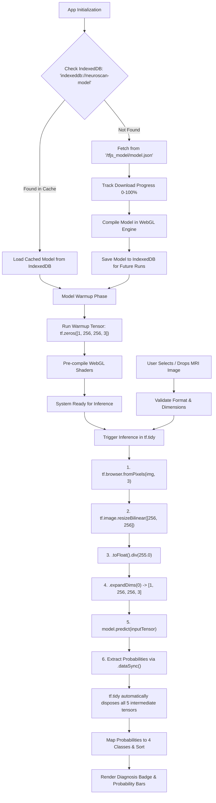

# 🧠 NeuroScan AI — Client-Side Brain Tumor MRI Diagnostic Suite

[](https://nextjs.org/)
[](https://react.dev/)
[](https://js.tensorflow.org/)
[](https://tailwindcss.com/)
[](https://www.typescriptlang.org/)
[](https://github.com/features/actions)
[](LICENSE)

**NeuroScan AI** is a pure client-side medical imaging diagnostic web application engineered to detect and classify brain tumors from MRI scans into 4 target pathology tiers:

1. **Glioma**
2. **Meningioma**
3. **No Tumor (Healthy)**
4. **Pituitary**

All machine learning execution runs 100% inside the user's browser using `@tensorflow/tfjs` with WebGL hardware acceleration — zero images or patient data are ever uploaded to an external server.

---

## ⚡ Key Architectural Highlights

- 🔒 **Zero Server Overhead & Complete Privacy:** Scans are processed locally via browser memory. Complies with strict medical privacy standards (HIPAA-friendly).
- 🚀 **Hardware Acceleration:** Native WebGL shader execution for ultra-low inference latency (~10–25ms on modern GPUs).
- 💾 **IndexedDB Offline Caching (`indexeddb://neuroscan-model`):** Model weight shards are downloaded on cold start and cached directly in browser storage for instantaneous subsequent page loads without network re-fetches.
- ⚡ **Automated Shader Warmup:** Runs a dummy inference pass (`tf.zeros([1, 256, 256, 3])`) upon model load to pre-compile WebGL shaders ahead of user interaction.
- 🛡️ **Zero GPU Memory Leaks:** 100% of preprocessing, tensor conversions, bilinear resizing, normalization, and predictions are isolated within `tf.tidy()`.
- 📊 **Graph Model Execution:** Seamlessly executes pre-trained quantized TensorFlow.js graph models via `tf.loadGraphModel()`.
- 🎨 **Clinical Light Theme Design:** Clean, modern clinical aesthetic with high-contrast radiological canvas and diagnostic indicators.

---

## 🎯 Model Specifications & Input Contract

| Parameter               | Specification                                                      |
| :---------------------- | :----------------------------------------------------------------- |
| **Model Format**        | TensorFlow.js Graph Model (`model.json` + quantized `.bin` shards) |
| **Input Shape**         | `(1, 256, 256, 3)` (Batch: 1, Height: 256, Width: 256, RGB: 3)     |
| **Data Type**           | Float32 Tensor                                                     |
| **Pixel Normalization** | $x \in [0.0, 1.0]$ via $x / 255.0$                                 |
| **Interpolation**       | Bilinear (`tf.image.resizeBilinear`)                               |
| **Output Layer**        | 4-unit Softmax Distribution                                        |
| **Target Classes**      | `0: Glioma`, `1: Meningioma`, `2: No Tumor`, `3: Pituitary`        |

---

## 🖼️ Features & UI Capabilities

- **Drag-and-Drop & Clipboard Upload:** Drop MRI scans (`PNG`, `JPEG`, `WEBP`) or paste directly with <kbd>Ctrl+V</kbd>.
- **Instant Test Presets:** 1-click test cases for all 4 pathology classes located in `public/preset/images/`.
- **Diagnostic Canvas Stage:** High-resolution medical viewport with HUD crosshairs, aspect-fit rendering, and animated scanning beam feedback.
- **Primary Diagnosis Badge:** High-contrast clinical outcome indicator with risk assessment and confidence percentage.
- **4-Class Probability Breakdown:** Animated horizontal distribution bars with softmax outputs.
- **Hardware Telemetry:** Live latency monitor (ms), active backend indicator (`WebGL`), and tensor memory guard monitor (`tf.tidy`).
- **Printable Medical Report:** Formatted clinical diagnostic report generator with one-click print and PDF save.

---

## 📁 Project Structure

```
neuroscan/
├── .github/
│   └── workflows/
│       └── ci-cd.yml             # GitHub Actions automated lint, typecheck, build & Vercel deployment
├── app/
│   ├── layout.tsx                # App root layout, SEO metadata, Geist font configuration
│   ├── page.tsx                  # Main client-side diagnostic dashboard
│   ├── globals.css               # Tailwind CSS v4 design tokens and clinical theme styles
│   └── favicon.ico               # Application favicon
├── components/
│   ├── Header.tsx                # Top navigation, live WebGL badge, tensor count, info trigger
│   ├── ModelStatusBar.tsx        # Real-time model loading progress bar and status banners
│   ├── Dropzone.tsx              # Drag-and-drop zone with clipboard paste and file validation
│   ├── SamplePresets.tsx         # 4-Class instant test preset carousel
│   ├── ScanViewer.tsx            # Canvas MRI viewport with HUD reticle and laser sweep
│   ├── PrimaryDiagnosis.tsx      # High-contrast clinical diagnosis card with confidence score
│   ├── ClassProbabilityBars.tsx  # 4-Class horizontal softmax distribution bars
│   ├── BenchmarkMetrics.tsx      # Hardware latency, engine telemetry, and memory health
│   ├── ModelInfoModal.tsx        # Input contract & IndexedDB cache management
│   └── ReportModal.tsx           # Formatted clinical report dialog with PDF/print export
├── lib/
│   ├── constants.ts              # Class metadata, risk levels, presets, and model config
│   ├── types.ts                  # TypeScript definitions for ML pipeline and application state
│   ├── tf-loader.ts              # GraphModel loader with IndexedDB caching and shader warmup
│   ├── tf-inference.ts           # Image preprocessing, tf.tidy() execution, and softmax parser
│   └── image-utils.ts            # Image validation and canvas aspect fitting
├── public/
│   ├── preset/
│   │   └── images/               # Authentic demo MRI scans for all 4 classes
│   │       ├── glioma_tumor.jpg
│   │       ├── meningioma_tumor.jpg
│   │       ├── normal_brain.jpg
│   │       └── pituitary_tumor.jpg
│   └── tfjs_model/
│       ├── model.json            # Quantized TensorFlow.js graph model manifest
│       └── group1-shard1of1.bin  # Quantized model weight shards
├── plan.md                       # Complete architectural and technical specification
└── package.json
```

---

## 🔄️ Lifecycle Pipeline



---

## 🚀 Getting Started

### 1. Prerequisites

- **Node.js**: v18.0.0 or higher
- **npm** (or `pnpm` / `yarn` / `bun`)

### 2. Installation

Clone the repository and install dependencies:

```bash
git clone https://github.com/Mizab1/NeuroScan-V2.git
cd NeuroScan-V2
npm install
```

### 3. Run Development Server

```bash
npm run dev
```

Open [http://localhost:3000](http://localhost:3000) in your browser.

### 4. Production Build & Lint Checks

```bash
npm run lint    # Code quality and TypeScript ESLint verification
npm run build   # Next.js Turbopack production compilation
npm run start   # Run production build locally
```

---

## 🔄 CI/CD & Deployment

This repository includes a continuous integration and deployment pipeline ([`.github/workflows/ci-cd.yml`](.github/workflows/ci-cd.yml)):

1. **Verification Job:** Runs on every push and pull request (`npm ci` &rarr; `npm run lint` &rarr; `npx tsc --noEmit` &rarr; `npm run build`).
2. **Vercel Production Deployment:** Automatically deploys production builds upon merges to `main`.

### Configuring GitHub Secrets for Vercel:

Add the following secrets under **Repository Settings &rarr; Secrets and variables &rarr; Actions**:

- `VERCEL_TOKEN`: Vercel Personal Access Token ([vercel.com/account/tokens](https://vercel.com/account/tokens))
- `VERCEL_ORG_ID`: Team or Account ID (obtained via `npx vercel link` or account settings)
- `VERCEL_PROJECT_ID`: Project ID (obtained via `npx vercel link` or project settings)

---

## 🔬 Model Conversion (Keras &rarr; TensorFlow.js)

To convert your own trained Keras/TensorFlow model to a TF.js Graph Model:

```bash
pip install tensorflowjs
tensorflowjs_converter \
    --input_format=tf_saved_model \
    --output_format=tfjs_graph_model \
    --quantize_uint8 \
    path/to/saved_model \
    public/tfjs_model/
```

---

## ⚖️ Clinical & Research Disclaimer

> **IMPORTANT:** NeuroScan AI is an experimental machine learning software prototype developed for engineering evaluation, research, and educational purposes. It does **not** constitute a certified medical device, clinical diagnostic tool, or medical prescription system. All findings must be independently reviewed and verified by a board-certified radiologist or medical professional.

---

## 📄 License

This project is licensed under the MIT License — see the [LICENSE](LICENSE) file for details.
