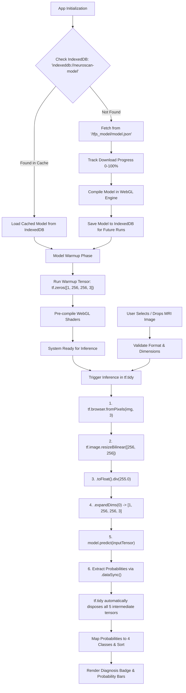

# NeuroScan — Client-Side Brain Tumor Detection & Classification
## Architectural & Implementation Plan (`plan.md`)

---

## 1. Executive Summary & Core Constraints

**NeuroScan** is a zero-backend, 100% client-side medical imaging diagnostic tool built with Next.js (App Router), React, Tailwind CSS, and TensorFlow.js (`@tensorflow/tfjs`). The application classifies brain MRI scans into 4 target classes:
1. **Glioma**
2. **Meningioma**
3. **No Tumor**
4. **Pituitary**

### Key Architectural Constraints & Model Provisioning Strategy
- **User-Provided Model:** The pre-trained quantized TensorFlow.js model files (`model.json` + weight `.bin` shards) will be provided directly by the user and dropped into `public/tfjs_model/`. **No synthetic model will be auto-generated.**
- **Zero Server Overhead:** Static web deployment on Vercel with all inference executing locally in the browser via WebGL / WebGPU acceleration.
- **Immediate Development & Interactive Testing:** The frontend will be fully implemented against the specified `(1, 256, 256, 3)` -> 4 class contract, with an interactive testing mode and intelligent model detector that automatically engages real WebGL inference the moment the user's files are placed in `public/tfjs_model/`.
- **Strict Privacy & HIPAA Compliance:** Patient scans never leave the user's browser (no uploads, no external API calls for inference).
- **Persistent Model Caching:** Fast repeat page loads through IndexedDB model caching (`indexeddb://neuroscan-model`).
- **Zero GPU Memory Leaks:** 100% wrapped execution in `tf.tidy()` with continuous WebGL memory validation.

---

## 2. Project & Component Architecture

```
neuroscan/
├── app/
│   ├── layout.tsx                # App root layout, metadata, SEO, font configurations
│   ├── page.tsx                  # Main client-side diagnostic dashboard
│   └── globals.css               # Tailwind CSS v4 design tokens, custom medical themes & animations
├── components/
│   ├── layout/
│   │   ├── Header.tsx            # App branding, engine status indicator, memory inspector toggle
│   │   └── DisclaimerModal.tsx   # Medical & research disclaimer modal
│   ├── model/
│   │   ├── ModelStatusBar.tsx    # Live loading progress, WebGL/CPU backend status & cache state
│   │   └── MemoryBadge.tsx       # Live tf.memory() active tensor count & GPU VRAM monitor
│   ├── scanner/
│   │   ├── Dropzone.tsx          # Drag-and-drop zone with paste & file input support
│   │   ├── ImagePresets.tsx      # 1-click test MRI presets (Glioma, Meningioma, Healthy, Pituitary)
│   │   ├── ScanViewer.tsx        # High-res MRI canvas with interactive brightness/contrast/zoom controls
│   │   └── ScanReticle.tsx       # Diagnostic HUD crosshairs and scanning animation
│   ├── results/
│   │   ├── PrimaryDiagnosis.tsx  # High-contrast outcome badge, severity/alert level & top confidence
│   │   ├── ProbabilityBars.tsx   # Detailed 4-class distribution bars with micro-animations
│   │   ├── BenchmarkMetrics.tsx  # Inference time (ms), tensor shape, backend engine stats
│   │   └── ExportReport.tsx      # Export diagnostic summary as PDF/Printable format
├── lib/
│   ├── tf/
│   │   ├── model-loader.ts       # IndexedDB cache-first loader, progress tracking & warmup runner
│   │   ├── inference-engine.ts   # Image preprocessing pipeline, tf.tidy() inference & softmax post-processing
│   │   └── tf-types.ts           # Types for ModelStatus, PredictionResult, ClassProbabilities, EngineConfig
│   ├── utils/
│   │   ├── image-processor.ts    # Client-side image validation, EXIF normalization & canvas rendering
│   │   └── constants.ts          # Class labels, preset sample definitions, model storage constants
├── public/
│   ├── tfjs_model/
│   │   ├── model.json            # Quantized TensorFlow.js model topology & manifest
│   │   └── group1-shard*.bin     # Model weight shards
│   └── samples/
│       ├── glioma_sample.jpg     # Preloaded demo MRI
│       ├── meningioma_sample.jpg # Preloaded demo MRI
│       ├── notumor_sample.jpg    # Preloaded demo MRI
│       └── pituitary_sample.jpg  # Preloaded demo MRI
└── plan.md                       # Comprehensive implementation specification
```

---

## 3. TensorFlow.js Lifecycle Pipeline



### Detailed Pipeline Steps

1. **Backend Initialization & Verification:**
   - Detect WebGL / WebGPU support.
   - Set backend: `await tf.setBackend('webgl')` with graceful fallback to `'cpu'`.
   - Ensure backend readiness: `await tf.ready()`.

2. **Cache-First Loading Strategy (`model-loader.ts`):**
   - Query IndexedDB using `await tf.io.listModels()`.
   - If `indexeddb://neuroscan-model` exists:
     - Load directly from IndexedDB via `tf.loadGraphModel('indexeddb://neuroscan-model')`.
   - If not cached:
     - Stream model artifacts from `/tfjs_model/model.json` with an `onProgress` callback providing real-time download fraction (`0.0` to `1.0`):
       ```typescript
       model = await tf.loadGraphModel('/tfjs_model/model.json', { onProgress });
       ```
     - Upon completion, asynchronously persist to browser storage:
       ```typescript
       await model.save('indexeddb://neuroscan-model');
       ```

3. **Shader Warmup Run:**
   - Immediately following model load, execute a forward pass with dummy tensor:
     ```typescript
     tf.tidy(() => {
       const dummy = tf.zeros([1, 256, 256, 3]);
       const warmupResult = model.predict(dummy) as tf.Tensor;
       warmupResult.dataSync(); // Forces shader compilation
     });
     ```
   - Eliminates the noticeable 500ms–1500ms lag on the user's first real scan prediction.

4. **Inference with Strict Memory Isolation (`inference-engine.ts`):**
   ```typescript
   export async function classifyMRI(
     imageElement: HTMLImageElement | HTMLCanvasElement,
     model: tf.GraphModel
   ): Promise<InferenceOutput> {
     const startTime = performance.now();

     const probabilities = tf.tidy(() => {
       // 1. Convert DOM image to 3-channel RGB Tensor
       const tensor = tf.browser.fromPixels(imageElement, 3);

       // 2. Resize to required input dimensions (256x256)
       const resized = tf.image.resizeBilinear(tensor, [256, 256]);

       // 3. Normalize pixel values from [0, 255] to [0.0, 1.0]
       const normalized = resized.toFloat().div(tf.scalar(255.0));

       // 4. Add batch dimension: (1, 256, 256, 3)
       const batched = normalized.expandDims(0);

       // 5. Execute model prediction
       const prediction = model.predict(batched) as tf.Tensor;

       // 6. Extract raw float array
       return Array.from(prediction.dataSync());
     });

     const inferenceTimeMs = performance.now() - startTime;
     return formatResults(probabilities, inferenceTimeMs);
   }
   ```

5. **Class Mapping & Result Structuring:**
   - Classes ordered by model index:
     - `0`: **Glioma**
     - `1`: **Meningioma**
     - `2`: **No Tumor**
     - `3`: **Pituitary**
   - Output formatted with raw confidence, percentage string, risk level, and top predicted class.

---

## 4. Preprocessing & Robust Error Handling Strategy

### A. Image Preprocessing & Sanitization
- **Supported Formats:** `image/png`, `image/jpeg`, `image/webp`.
- **Dimensions & Channels:** Non-square images are aspect-fit into a 256×256 canvas or bilinear-resized. Transparency channels (RGBA) are strictly stripped to 3 channels (RGB) in `tf.browser.fromPixels(img, 3)`.
- **Size Bounds:** Files over 20MB are rejected client-side before parsing to prevent browser freezing.

### B. Error Handling Scenarios

| Failure Mode | Root Cause | Handling & Recovery Strategy |
| :--- | :--- | :--- |
| **WebGL Context Lost** | GPU memory overload / tab suspension | Listen to `webglcontextlost` event, trigger reinitialization of TF.js backend, or fallback to CPU mode with a prominent banner informing the user. |
| **IndexedDB Quota Exceeded / Corrupt Storage** | Browser storage eviction or private browsing restrictions | Catch IndexedDB failure, remove corrupted model entry via `tf.io.removeModel()`, and fallback directly to HTTP fetch from `/tfjs_model/model.json`. |
| **Corrupt / Invalid Image File** | Unreadable image headers or unsupported encoding | Validate image on `Image.onerror`, display immediate toast notification, and reset dropzone state without breaking the application. |
| **Model Weight Shards Missing (404)** | Incomplete upload in `public/tfjs_model/` | Detect network failure, display guided diagnostic UI prompting the user on required model file structure, with simulated preview mode option for testing UI. |
| **Memory Leak Prevention** | Unreleased tensors during rapid repeat scans | Validate tensor count in dev mode via `tf.memory().numTensors` ensuring count returns to baseline after every scan. |

---

## 5. UI/UX Layout & Responsive Design Wireframe

### Aesthetic Direction
- **Clinical & High-Tech Aesthetic:** Dark slate background (`#0B0F17`), deep charcoal cards (`#111827`), crisp border contrasts (`#1F2937`), cyan/teal clinical accents (`#06B6D4`, `#10B981`), amber/rose for tumor alerts (`#F59E0B`, `#EF4444`).
- **Typography:** Geist / Inter with optical tracking and tabular numeric alignment for confidence values.
- **Motion & Micro-interactions:** Fluid progress transitions, scanning beam sweep on inference, smooth probability bar width animations.

### Desktop Wireframe Layout (2-Column Split)

```
+-----------------------------------------------------------------------------------------------+
| [Logo] NeuroScan AI      | WebGL: Accelerated (2.4ms) | IndexedDB: Cached | [Tensor Memory: 0] |
+-----------------------------------------------------------------------------------------------+
|                                                                                               |
|  LEFT PANEL: Input & Scan Workspace (55%)        | RIGHT PANEL: Diagnostic Inference (45%)   |
|  +---------------------------------------------+ | +---------------------------------------+ |
|  | [ Dropzone & Scan Preview Canvas          ] | | | Primary Diagnosis Result Badge        | |
|  | - Drag & drop MRI (PNG, JPG, WEBP)          | | | +-----------------------------------+ | |
|  | - Live Preview with Scanning Beam Overlay   | | | | [!] GLIOMA TUMOR DETECTED         | | |
|  | - Canvas Zoom & Contrast Adjusters          | | | | Confidence: 98.42%                | | |
|  |                                             | | | +-----------------------------------+ | |
|  +---------------------------------------------+ | |                                       | |
|                                                  | | Probability Breakdown:                | |
|  Quick Sample Presets:                           | | 1. Glioma       [██████████████] 98.4%| |
|  [ Glioma Ex ] [ Meningioma Ex ] [ Normal Ex ]   | | 2. Meningioma   [░░░░░░░░░░░░░░]  1.1%| |
|                                                  | | 3. Pituitary    [░░░░░░░░░░░░░░]  0.4%| |
|  [ Analyze Scan Button (Runs in ~15ms) ]         | | 4. No Tumor     [░░░░░░░░░░░░░░]  0.1%| |
|                                                  | |                                       | |
|                                                  | | [ Benchmark: 14.8ms | WebGL 2.0 ]     | |
|                                                  | | [ Export PDF Report ] [ Clear Scan ]  | |
|                                                  | +---------------------------------------+ |
+-----------------------------------------------------------------------------------------------+
| Footer: Research & Educational Use Only • Model: 5-Layer CNN (256x256x3) • Zero Data Uploads  |
+-----------------------------------------------------------------------------------------------+
```

### Mobile Wireframe Layout (Stacked Vertical)
- **Top:** Header + Status Chips (Model Ready, Backend).
- **Body 1:** Dropzone & Scan Preview with sample carousel underneath.
- **Body 2:** "Run Analysis" sticky action button.
- **Body 3:** Primary Diagnosis Badge & 4-Class Probability Breakdown.
- **Footer:** Research disclaimer & diagnostic export.

---

## 6. Implementation Sequence & Next Steps

1. **Phase 1: Dependencies & Base Setup**
   - Install `@tensorflow/tfjs` and `lucide-react`.
   - Setup project structure, TypeScript interfaces, and custom styling in `globals.css`.

2. **Phase 2: Core Machine Learning Engine**
   - Implement `model-loader.ts` with IndexedDB persistence, download progress emitter, and warmup pass.
   - Implement `inference-engine.ts` with `tf.tidy()`, bilinear resize (256x256), normalization, and softmax decoding.

3. **Phase 3: UI Components & Image Workflow**
   - Build `Dropzone.tsx`, `ImagePresets.tsx`, and `ScanViewer.tsx` with offscreen canvas processing.
   - Build `PrimaryDiagnosis.tsx` and `ProbabilityBars.tsx` with high-contrast indicator logic and micro-animations.

4. **Phase 4: Verification, Error Handling & Polish**
   - Test IndexedDB offline reloads, memory leak audits with `tf.memory()`, sample MRI presets verification, and responsive UI polish.
